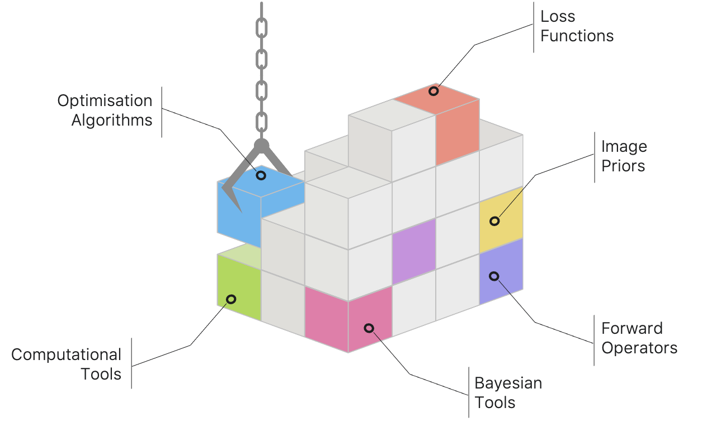
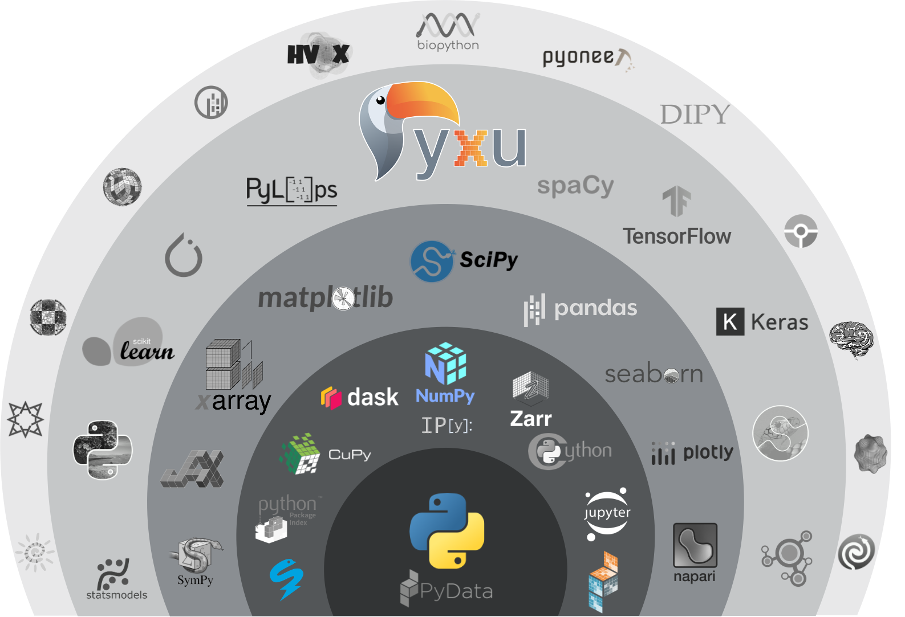

:html_theme.sidebar_secondary.remove:
:sd_hide_title: true

.. |br| raw:: html
   
    

.. raw:: html

    <!-- CSS overrides on the homepage only -->
    

.. raw:: html

    

    
  <!-- Start Hero Left -->

Pyxu
====

.. raw:: html 

    <h2 style="font-size: 60px; font-weight: bold; display: inline">Pyxu</h2>
    <h3 style="margin-top: 0; font-weight: bold; text-align: left; ">Modular & Scalable Computational Imaging</h3>
    

    <strong> Pyxu </strong> (pronounced [piksu], formerly known as Pycsou) is an open-source Python framework 
    allowing scientists at any level to quickly prototype/deploy <em> hardware accelerated and out-of-core </em> computational imaging pipelines at scale.
    Thanks to its hardware-agnostic <strong>microservice architecture </strong> and its tight integration with the PyData ecosystem, 
    Pyxu supports a wide range of imaging applications, scales, and computation architectures.
    

    
    

    

        <a href="./intro/index.html" class="homepage-button primary-button">Get Started</a>
        <a href="./examples/index.html" class="homepage-button secondary-button">See Examples</a>
    

    

        <a href="./api/index.html" class="homepage-button-link">See API Reference →</a>
    

    

    
  <!-- End Hero Left -->

.. raw:: html 

    
  <!-- Start Hero Right -->

.. raw:: html

    
  <!-- End Hero Right -->
    
  <!-- End Hero -->
    

.. grid:: 4 4 8 8
    :gutter: 2

    .. grid-item-card::
        :shadow: none
        :class-card: sd-border-0
        :img-background: ./_static/grid_denoising.png
    
    .. grid-item-card::
        :shadow: none
        :class-card: sd-border-0    
        :img-background: ./_static/grid_deblurring.png
    
    .. grid-item-card::
        :shadow: none
        :class-card: sd-border-0
        :img-background: ./_static/grid_inpainting.png

    .. grid-item-card::
        :shadow: none
        :class-card: sd-border-0
        :img-background: ./_static/grid_superresolution.png    

    .. grid-item-card::
        :shadow: none
        :class-card: sd-border-0
        :img-background: ./_static/grid_demultiplexing.png    
    
    .. grid-item-card::
        :shadow: none
        :class-card: sd-border-0
        :img-background: ./_static/grid_interferometry.png    
    
    .. grid-item-card::
        :shadow: none
        :class-card: sd-border-0
        :img-background: ./_static/grid_fusion.png    
    
    .. grid-item-card::
        :shadow: none
        :class-card: sd-border-0
        :img-background: ./_static/grid_tomography.png    
    

.. raw:: html

    
 

Key Features & Capabilities
===========================

.. grid:: 2 2 2 3
    :gutter: 3

    .. grid-item-card:: 
            :shadow: none
            :class-card: sd-border-0

            .. figure:: ./_static/microservice.png
               :scale: 5%
               :class: no-scaled-link
            
            .. raw:: html

                

                <strong> Microservice architecture </strong>   
                Loosely coupled software components that are composable via an advanced <em> operator algebra</em>.
                

               

    .. grid-item-card::
            :shadow: none
            :class-card: sd-border-0

            .. figure:: ./_static/pnp.png
               :scale: 5%
               :class: no-scaled-link
               
            .. raw:: html

                

                <strong> Plug-and-play API </strong>   
                Simple interface for beginners with theory-informed automatic hyperparameter selection.
                Experts may still fine-tune parameters via a <em> guru </em> interface.
                

    .. grid-item-card::
            :shadow: none
            :class-card: sd-border-0

            .. figure:: ./_static/scope.png
               :scale: 4%
               :class: no-scaled-link

            .. raw:: html

                

                <strong> Application agnostic </strong>   
                Generic software components with wide applicability across imaging modalities.
                
             
                    
    
    .. grid-item-card::
            :shadow: none
            :class-card: sd-border-0

            .. figure:: ./_static/hybrid.png
               :scale: 4%
               :class: no-scaled-link

            .. raw:: html

                

                <strong> Flexible computation backends </strong>   
                The same code executes for multiple array backends, including CPU and GPU, with a unified, easily maintainable codebase.
                
             
                    

    .. grid-item-card::
            :shadow: none
            :class-card: sd-border-0

            .. figure:: ./_static/hpc.png
               :scale: 5%
               :class: no-scaled-link
               
            .. raw:: html

                

                <strong> High-performance computing </strong>   
                Just-in-time compilation, batch processing, automatic parallelization, out-of-core computing,
                and controllable computation precision.
                
             
                                   

    .. grid-item-card::
            :shadow: none
            :class-card: sd-border-0

            .. figure:: ./_static/interop.png
               :scale: 4%
               :class: no-scaled-link

            .. raw:: html

                

                <strong> Interoperability </strong>   
                Pyxu is highly interoperable with the <em>PyData stack</em>, including full-fledged zero-copy wrappers for 
                <a href="https://jax.readthedocs.io/en/latest/">JAX</a> and <a href="https://pytorch.org/">PyTorch</a> operators.
                
             

    .. grid-item-card::
            :shadow: none
            :class-card: sd-border-0

            .. figure:: ./_static/test.png
               :scale: 4%
               :class: no-scaled-link

            .. raw:: html

                

                <strong> Quality controlled </strong>   
                Extensive logical and functional unit testing of software components. Templated test classes for custom operators.
                
             

    .. grid-item-card::
            :shadow: none
            :class-card: sd-border-0

            .. figure:: ./_static/git.png
               :scale: 4%
               :class: no-scaled-link

            .. raw:: html

                

                <strong> Community driven </strong>   
                Pyxu is open source, version controlled, and is available to all on 
                <a href="https://pypi.org/project/pyxu/">PyPI</a> and <a href="https://github.com/matthieumeo/pyxu">GitHub</a>.
                
             

    .. grid-item-card::
            :shadow: none
            :class-card: sd-border-0

            .. figure:: ./_static/fair.png
               :scale: 4%
               :class: no-scaled-link

            .. raw:: html

                

                <strong> Extensible </strong>   
                Powerful plugin mechanism and community marketplace (<a href="./fair/index.html">Pyxu FAIR</a>) for discovering and sharing custom operators.
                
             
               
Ecosystem
=========

Pyxu is part of, looks and feels like, and is highly interoperable with the wider scientific Python ecosystem. It is indeed built on a minimal set of foundational and robust scientific computing 
librairies from the PyData stack. Pyxu notably supports multiple array backends --`NumPy <https://numpy.org/>`_, `Dask <https://www.dask.org/>`_, `Sparse <https://sparse.pydata.org/en/stable/>`_ and 
optionally `CuPy <https://cupy.dev/>`_--, allowing users to choose array backends that work best for their application/computation.
Aside from `SciPy <https://scipy.org/>`_ and  `Numba <https://numba.pydata.org/>`_ -- which we use for scientific computing and `JIT-compilation <https://numba.readthedocs.io/en/stable/user/5minguide.html#how-does-numba-work>`_ respectively--
these are Pyxu's **only** dependencies, making the software very easy to ship, install, deploy in production, and sustain in the long term.

Pyxu is also interoperable with (but does not depend on) the major deep learning frameworks `JAX <https://jax.readthedocs.io/en/latest/>`_ and `PyTorch <https://pytorch.org/>`_,
allowing users to benefit from the latest incursions of deep learning in the field of computational imaging (e.g., PnP methods, unrolled neural networks, deep generative priors). 
Our wrappers can moreover leverage the autograd engine to auto-infer gradients or adjoints operations. 

.. grid:: 2 2 4 4
    :gutter: 3

    .. grid-item-card:: 
            :shadow: none
            :class-card: sd-border-0

            .. image:: _static/numpy_logo.svg
               :width: 75%
               :align: center
               :alt: NumPy's logo
               :target: https://numpy.org/

            .. raw:: html 
              
                

                NumPy is the fundamental package for array computing with Python.
                

    .. grid-item-card:: 
            :shadow: none
            :class-card: sd-border-0

            .. image:: _static/dask_horizontal.svg
               :width: 70%
               :align: center
               :alt: Dask's logo
               :target: https://www.dask.org/

            .. raw:: html 
              
                

                NumPy-compatible distributed arrays and advanced parallelism for both in and out-of-core computing, enabling performance at scale.
                

    .. grid-item-card:: 
            :shadow: none
            :class-card: sd-border-0

            .. image:: _static/cupy.png
               :width: 75%
               :align: center
               :alt: CuPy's logo
               :target: https://cupy.dev/

            .. raw:: html 
              
                

                NumPy-compatible array library for GPU-accelerated computing with Python.
                

    
    .. grid-item-card:: 
            :shadow: none
            :class-card: sd-border-0

            .. image:: _static/sparse-logo.png
               :width: 65%
               :align: center
               :alt: Sparse's logo
               :target: https://sparse.pydata.org/en/stable/

            .. raw:: html 
              
                

                Sparse multi-dimensional arrays for the PyData ecosystem.
                

    
    .. grid-item-card:: 
        :shadow: none
        :class-card: sd-border-0

        .. image:: _static/scipy.png
            :width: 70%
            :align: center
            :alt: SciPy's logo
            :target: https://scipy.org/

        .. raw:: html 
            
            

            Fundamental algorithms for scientific computing in Python.
            

    .. grid-item-card:: 
        :shadow: none
        :class-card: sd-border-0

        .. image:: _static/numba-blue-horizontal-rgb.svg
            :width: 85%
            :align: center
            :alt: Numba's logo
            :target: https://numba.pydata.org/

        .. raw:: html 
            
            

            NumPy-aware dynamic Python compiler using <a href="https://llvm.org/">LLVM</a>.
            

    .. grid-item-card:: 
            :shadow: none
            :class-card: sd-border-0

            .. image:: _static/Pytorch_logo.png
               :width: 75%
               :align: center
               :alt: PyTorch's logo
               :target: https://pytorch.org/

            .. raw:: html 
              
                

                Tensors and dynamic neural networks in Python with strong GPU acceleration.
                

    .. grid-item-card:: 
            :shadow: none
            :class-card: sd-border-0

            .. image:: _static/jax_logo_250px.png
               :width: 40%
               :align: center
               :alt: JAX's logo
               :target: https://jax.readthedocs.io/en/latest/

            .. raw:: html 
              
                

                Composable transformations of Python+NumPy programs: differentiate, vectorize, JIT to GPU/TPU, and more.
                

Governance and Team
===================
Pyxu is an **open-source project** developed and maintained primarily by members of the `EPFL Center for Imaging <https://imaging.epfl.ch/>`_, 
but the repository itself is public and we welcome external contributions. We are committed to keeping the project public and owned by the community through 
a meritocratic and consensus-based governance. Anyone with an interest in the project can join the community, contribute to the project design, 
and participate in the decision-making process.

.. grid:: 1 2 3 3
    :gutter: 3

    .. grid-item-card:: 
            :shadow: none
            :class-card: sd-border-0

            .. image:: _static/EPFL_Logo_Digital_BLACK_PROD.png
               :width: 60%
               :align: center
               :target: https://www.epfl.ch/en/

    .. grid-item-card:: 
            :shadow: none
            :class-card: sd-border-0

            .. image:: _static/imaging.png
               :width: 60%
               :align: center
               :target: https://imaging.epfl.ch/
    
    .. grid-item-card:: 
            :shadow: none
            :class-card: sd-border-0

            .. image:: _static/air.svg
               :width: 40%
               :align: center

Steering Council
----------------

The role of Pyxu's Steering Council is to ensure the long-term sustainability of the project, both technically and as a community. 
Pyxu's Steering Council meets regularly (every two weeks or so) and currently consists of the following members:

.. grid:: 2 2 3 3
    :gutter: 3

    .. grid-item-card:: 
            :shadow: none
            :class-card: sd-border-0

            .. image:: _static/simeoni.png
               :width: 40%
               :align: center
               :target: https://github.com/matthieumeo

            .. raw:: html 
              
                

                <strong> Matthieu Simeoni </strong>   
                Pyxu's creator/architect, project manager & team lead
                

    
    .. grid-item-card:: 
            :shadow: none
            :class-card: sd-border-0

            .. image:: _static/kashani.png
               :width: 40%
               :align: center
               :target: https://github.com/SepandKashani

            .. raw:: html 
              
                

                <strong> Sepand Kashani </strong>   
                Technical lead, software architect & tests
                

    
    .. grid-item-card:: 
            :shadow: none
            :class-card: sd-border-0

            .. image:: _static/rue_queralt.png
               :width: 40%
               :align: center
               :target: https://github.com/joanrue

            .. raw:: html 
              
                

                <strong> Joan Rué-Queralt </strong>   
                Technical lead, solution architect & plugins
                

        
Contributors
------------
In addition to the steering council, the following people are currently (or have been in the past) 
core contributors to Pyxu's development and/or maintenance (alphabetical order, full list available on GitHub):

.. grid:: 2 2 3 3
    :gutter: 3

    .. grid-item-card:: 
            :shadow: none
            :class-card: sd-border-0

            .. image:: _static/debarre.png
               :width: 40%
               :align: center
               :target: https://github.com/ThomasDeb

            .. raw:: html 
              
                

                <strong> Thomas Debarre </strong>  
                Core contributor (Emeritus)
                

    .. grid-item-card:: 
            :shadow: none
            :class-card: sd-border-0

            .. image:: _static/flowers.png
               :width: 40%
               :align: center
               :target: https://github.com/alec-flowers

            .. raw:: html 
              
                

                <strong> Alec Flowers </strong>   
                Contributor (Emeritus)
                

    .. grid-item-card:: 
            :shadow: none
            :class-card: sd-border-0

            .. image:: _static/hamm.png
               :width: 40%
               :align: center
               :target: https://github.com/dhamm97

            .. raw:: html 
              
                

                <strong> Daniele Hamm </strong>   
                Contributor
                

    .. grid-item-card:: 
            :shadow: none
            :class-card: sd-border-0

            .. image:: _static/jarret.png
               :width: 40%
               :align: center
               :target: https://github.com/AdriaJ

            .. raw:: html 
              
                

                <strong> Adrian Jarret </strong>  
                Contributor
                

    .. grid-item-card:: 
            :shadow: none
            :class-card: sd-border-0

            .. image:: _static/salim.png
               :width: 40%
               :align: center
               :target: https://github.com/Dicedead

            .. raw:: html 
              
                

                <strong> Salim Najib </strong>  
                Contributor
                

    .. grid-item-card:: 
            :shadow: none
            :class-card: sd-border-0

            .. image:: _static/okumus.png
               :width: 40%
               :align: center
               :target: https://github.com/okumuskaan

            .. raw:: html 
              
                

                <strong> Kaan Okumus </strong>   
                Contributor (Emeritus)
                

Partners & Sponsors
===================

.. raw:: html 
   

    

    

    
    

    

    

    

    

    

    

    

    

    

    

    

    

    

    

    

    

    

    

    

    

    

    
    

    

    

    

    

    

    

    

    

    

    

    

    

    

    

    

    

    

    

    

    

    

    

    
    

    

    

.. toctree::
   :maxdepth: 1
   :hidden: 

   intro/index
   guide/index
   examples/index
   api/index
   fair/index
