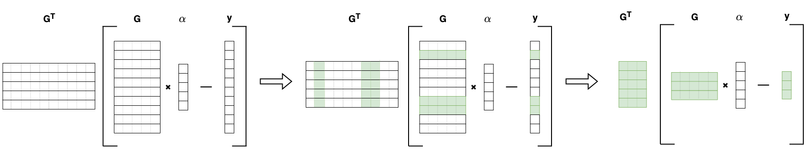
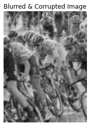
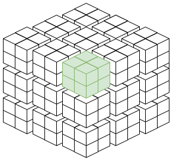
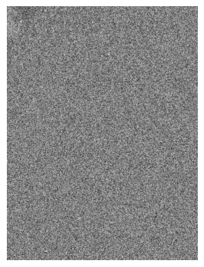
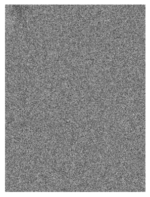

.. _stochastic:

Stochastic
==========

Background Concepts
-------------------

In solving linear inverse problems we can formulate our objective function as a sum structured objective function:

.. math::
    \begin{gather}
        f(x) = \frac{1}{n}\sum^n_{i=1}f_i(x)
    \end{gather}

where :math:`n` is the number of measurements, :math:`x \in \mathbb{R}^d`, each :math:`f_i: \mathbb{R}^d \rightarrow \mathbb{R}` is convex and has Lipschitz continuous derivatives with constant :math:`L`.

.. Note::

    For machine learning practitioners :math:`i` can be seen as the :math:`i`-th training sample in :math:`n` total training samples. For example one image of the MNIST dataset.
    In solving inverse problems the :math:`i`-th signal is often a single discretized measurement (see Discretization). For example in image deblurring this would be one pixel of the image you are trying to deblur.

We can solve this objective function through gradient descent (GD), which takes the entire data vector, computes the gradient, and takes a step in the direction of steepest descent.

.. math::

    x_{t+1} = x_t - \frac{\eta}{n}\sum^n_{i=1}\nabla f_i(x_t)

where :math:`\eta` is the step size, and :math:`t` is the time step.
GD underlies many of the major algorithms pycsou supports.
Given the assumptions of convexity and Lipschitz continuous derivatives GD converges linearly to the optimum :math:`g(x_t) - g(x^*) = O(1/t)` with a constant :math:`\eta`.
However, the cost per iteration of this method scales linearly in :math:`n`, which makes it unappealing when :math:`n` is large.

Stochastic Optimization
-----------------------

Stochastic first-order optimization algorithms are commonly used in large scale applications and for high dimensional optimization tasks, such as in machine learning.

Stochastic gradient descent (SGD) samples one training sample at random and uses this as an unbiased estimator of the gradient.
This is :math:`n` times cheaper than gradient descent per iteration!

.. math::

    \begin{gather*}
        \text{sample } i_t \in [n] \text{ uniformly at random}\\
        x_{t+1} = x_t - \eta_t \nabla f_i(x)
    \end{gather*}

SGD requires a suitably chosen decreasing step size :math:`\eta_k` to achieve :math:`\mathbb{E}[g(x_t)] - g(x^*) = O(1/\sqrt{t})`.
Convergence is slower due to the variance from using a stochastic estimate, and we must appropriately shrink our step-size to converge absolutely (with a fixed step size the best we can do is converge to a region around the optimum).

Batch gradient descent (BGD) samples a batch of training samples.
If the batch size is one, we recover SGD, if it is :math:`n` we recover GD.
BGD allows us to trade off between cost per iteration and reducing variance of the gradient estimate.

.. math::
    \begin{gather*}
        \text{uniformly sample mini-batch of indices } \mathcal{B}_t = \{i_t^j \in \{1,...,n\} | j=1,..,m\}\\
        x_{t+1} = x_t - \frac{\eta_t}{m} \sum_{i \in \mathcal{B}_t }\nabla f_i(x)
    \end{gather*}

In Linear Inverse Problems
~~~~~~~~~~~~~~~~~~~~~~~~~~

Gradient descent continues to be the standard method for solving linear inverse problems with a differentiable and :math:`L`-Lipschitz objective function.
However, due to the success of SGD and BGD in the field of machine learning, another field that deals with large sets of high dimensional data, there is interest in understanding and utilizing the properties of stochasticity in optimizing inverse problems.

The benefits of stochasticity are:

1. Stochastic optimization can speed up convergence for certain linear inverse problems [StocInv]_.
2. Because only portions of the data are loaded into memory during one iteration, stochastic optimization offers a solution should the data be too large to fit into memory.
3. There is a potential for parallelization of batches across CPU's/GPU's.

We can use stochastic optimization even when the objective function includes non-differentiable proximal functions such as regularizers.
Since all algorithms separate the differentiable and non-differentiable objective functions, we replace the differentiable gradient update with a stochastic version and can reap all the benefits listed above.

Applying stochastic methods in inverse problems requires batching both the data and the forward operator.

With Explicit Linear Operators
~~~~~~~~~~~~~~~~~~~~~~~~~~~~~~

To clarify explicitly how BGD would work, we use an example with an explicit linear operator.
Given a simplified linear inverse problem :math:`y = G\alpha` where :math:`G \in \mathbb{R}^{10 \times 5}` is our forward operator, :math:`y \in \mathbb{R}^{10}` is our data measurements, :math:`\alpha \in \mathbb{R}^5` is our signal we want to reconstruct, we define an optimization problem using the data fidelity term of the least squares loss.
To form mini-batches of size :math:`m` we define a sub-sampling operator :math:`S \in \mathbb{R}^{m \times 10}` which selects :math:`m` indices at random.

.. math::
    \begin{split}
        \text{Normal Least Squares}\\
        f(x) = \frac{1}{2n}\Vert G\alpha - y \Vert^2_2 \\
        \nabla f(x) = \frac{1}{n} G^T(G\alpha - y)\\
    \end{split}
    \hspace{4cm}
    \begin{split}
        \text{Least Squares with Batching}\\
        f_{S_i}(x) = \frac{1}{2m}\Vert S_i G\alpha - S_i y \Vert^2_2 \\
        \nabla f_{S_i}(x) = \frac{1}{m} (S_i G)^T(S_i G\alpha - S_i y)\\
    \end{split}

Where our gradient update takes the form :math:`x_{t+1} = x_t - \eta_t \nabla f_{S_i}(x)`.
Below we show a visual depiction of how the gradient is actually computed given that indices :math:`\{1, 6, 7\}` are selected for the mini-batch.

    Visual depiction of matrix multiplication starting with :math:`\nabla f(x)` and subsampling to :math:`\nabla f_{S_i}(x)`. Only 3 measurements from our y data vector are needed and we save 2/3 of the computations over the original full gradient computation.

With Matrix-Free Linear Operators
~~~~~~~~~~~~~~~~~~~~~~~~~~~~~~~~~

When solving large, high dimensional optimization tasks it is often the case that operators are defined in a matrix-free manner.
If we are already constrained by the size of the data, building an explicit matrix can be prohibitively expensive.

``Pycsou`` supports matrix-free operators out of the box, but batching a matrix-free operator requires detailed knowledge of the operator and custom code.
We provide an example :py:func:`pycsou.opt.stochastic.ConvolveLoader` of a batched Convolution operator and offer tools for an advanced user to build their own batched operators.

In Pycsou
~~~~~~~~~

We will solve a linear inverse problem as an example to introduce the main components of stochastic optimization in ``Pycsou``.
The problem is a combined image deblurring and inpainting problem.
We take an image and convolve it with an out-of-focus blur kernel of radius :math:`6`.
Then we corrupt :math:`10\%` of the pixels with salt and pepper noise and save this as our self-made measurement.
Mathematically our signal

.. math::
    y = Cx + \epsilon

where :math:`y \in \mathbb{R}^{480000}` is our measurement, :math:`x \in \mathbb{R}^{480000}` is the underlying image , :math:`C \in \mathbb{R}^{480000 \times 480000}` is the Convolve operator with an out-of-focus blur kernal, and :math:`\epsilon \in \mathbb{R}^{480000}` is a vector of :math:`\epsilon_i \stackrel{iid}{\sim} Laplace(0, \sigma)` for :math:`i \in [1, ..., 480000]`

|truth|  |corrupt|

.. Hint::

    The code blocks in this section build on one another and must be run sequentially in a jupyter notebook, or pasted one after the other into a .py file.

.. code-block:: python3

    import numpy as np
    import matplotlib.pyplot as plt
    import datetime as dt

    import pycsou.abc.solver as pycs
    import pycsou.opt.stop as pycos
    import pycsou.opt.solver.pgd as pgd
    import pycsou.opt.stochastic as pystoc
    import pycsou._dev as dev
    import pycsou._dev.stochastic.stoc_utils as devs

    img_shape = (800, 600)

    # define blur kernal and Convolution operator
    oof_blur = devs.out_of_focus_kernel(r=6)
    overlap = oof_blur.shape[0] // 2
    Cop = dev.Convolve(data_shape=img_shape, filter=oof_blur, mode="reflect")
    # Gop.lipschitz() - Lipschitz has been precomputed
    Cop._lipschitz = np.array([0.99913936])

Load
^^^^

The ``Load`` class provides a way to read data from disk. Because we use dask to do batching, the ``Load`` class must support numpy style indexing and contain the attributes ``shape``, ``ndim``, and ``dtype``.

.. code-block:: python3

    load = pystoc.NpzLoad('tour_de_france.npy')
    stacking_dim = load.shape[:-1]
    data_dim = load.shape[-1]

    ground_truth = np.load('tour_de_france_truth.npy')

BlockLoader
^^^^^^^^^^^

    Visual depiction of the block loader separating a 3D array into blocks. The selected block is 1 batch of data.

``Loader`` classes define a batching strategy. In this case the batching strategy is blocks and it can batch data provided from a ``Load`` class or a ``Load``-like object.
``Loader`` classes have an abstract method ``create_op`` which defines how an operator should be batched.
This function will change depending on the operator as well as the batching strategy and therefore must be overwritten by the user.

An example where we subclass ``BlockLoader`` and write a function which batches the matrix-free convolution operator can be found :py:func:`pycsou.opt.stochastic.ConvolveLoader`

.. Important::

    It is pycsou convention to have the last dimension of an array be the flattened data dimension and all other dimensions be stacking dimensions. (TODO reference explanation)
    ``Loader`` classes assume this convention and therefore any ``Load`` or ``Load-type`` object should present data in this manner.

.. Note::

    In real life it is difficult to shrink the batch size and see a linear shrinking of the computation per iteration. Too small of batches and the cost of dataloading, recomposing the stochastic objective function, and data manipulations begin to out weight the speed of computing very small batches.

Batch
^^^^^

``Batch`` is simple wrapper class that queries the loader for the data and batched operator in a generator ``batches()`` and keeps track of the batch state.

.. code-block:: python3

    mini_batch = (100, 100)
    loader = pystoc.ConvolveLoader(
        load = load,
        blocks=mini_batch,
        data_shape=img_shape,
        operator=Cop,
        depth=(overlap, overlap),
        mode='reflect'
    )
    batch = pystoc.Batch(loader, shuffle=True)

GradStrategy
^^^^^^^^^^^^

The ``GradStrategy`` class defines the gradient update strategy.
Currently ``SGD`` is supported and it passes through the gradient update unchanged.
In the future, we will support variance-reduced stochastic gradient descent such as ``SAGA`` [SAGA]_ which gives better convergence guarantees.

Stochastic
^^^^^^^^^^

The final and most important class is the ``Stochastic`` class which is a ``DiffFunc``.
It is this class which provides the entry point into the ``Pycsou`` framework and handles all of the stochasticity.
This class takes in a ``DiffFunc``, a ``Loader``, and a ``GradStrategy`` and creates a new optimization objective each iteration with a batch of data and a batched operator.

.. Note::

    This stochastic loss can be used in any solver that utilizes gradient descent. This includes :py:func:`pycsou.opt.solver.pgd` and :py:func:`pycsou.opt.solver.pds`

.. code-block:: python3

    grad_strategy = pystoc.SGD()
    stoc_func = pystoc.Stochastic(f=dev.SquaredL2Norm(), batch=batch, strategy=grad_strategy)

Now that we have defined our stochastic functional, we can build our optimization problem. The optimization problem we are solving is:

.. math::

    \Vert C_i x - y_i \Vert^2_2 + \mu \Vert Gx \Vert^2_2

where :math:`C_i` is a batched convolution operator, :math:`y_i` is a batch of data, and :math:`G \in \mathbb{R}^{480000x480000}` is a first derivative operator.

.. code-block:: python3

    Gop = dev.GradientOp(img_shape, load.shape[-1], kind="forward")
    Gop._lipschitz = np.array([2.82841955])
    # Gop.lipschitz() - Lipschitz has been precomputed

    mu = 1 / (2 * np.prod(mini_batch))
    reg = mu * dev.SquaredL2Norm() * Gop

    F = stoc_func + reg

Lastly we select an algorithm to solve our optimization problem. Here we select PGD. We also define a few stopping criteria and then set up a loop so we can look at our reconstruction as we progress.

.. code-block:: python3

    pgd = pgd.PGD(F)

    def loss(x):
        return np.sum((x - ground_truth)**2, keepdims=True)

    stop_crit = pycos.MaxIter(n=1000) | pycos.AbsError(eps=1e-10, f=loss) | pycos.MaxDuration(t=dt.timedelta(seconds=6000))

    x0 = np.random.random(load.shape)

    pgd.fit(
        x0=x0,
        stop_crit=stop_crit,
        mode=pycs.Mode.MANUAL,
        acceleration=False,
        d=75
    )

    for i, data in enumerate(pgd.steps()):
        if i % 30 == 0:
            plt.imshow(data['x'].reshape(img_shape), cmap='gray', vmin=0, vmax=1)
            plt.title(f"Reconstruct Iteration: {i}")
            plt.show()

    xs = pgd.solution()

    plt.imshow(xs.reshape(img_shape), cmap='gray', vmin=0, vmax=1)
    plt.title("Solution")
    plt.show()

This gif was made by running the above code and taking snapshots every 10 iterations for 800 iterations.

This gif was run with the above code, but without random mini-batching, so that the updates are very clearly visualized.

.. figure:: gd_progress.gif
   :width: 40%

This gif was made by using normal gradient descent and taking a snapshot every iteration for 80 iterations.

|truth2|  |corrupt2|

