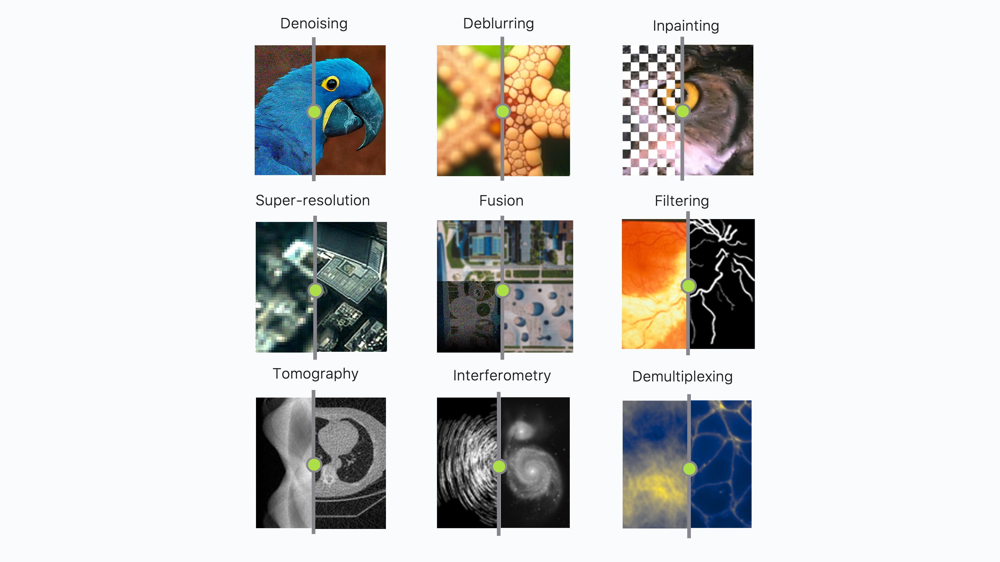

# Summary

The advent of computational imaging (CI) has brought about transformative changes in digital image restoration and enhancement, positioning CI methods at the heart of computer vision, biomedical imaging, radio-interferometry, and other fields. This evolution is particularly crucial in an era where the volume of image data, combined with the complexity of restoration and enhancement tasks, poses significant computational challenges. The ability to effectively process and improve the quality of images captured under suboptimal conditions—enhancing resolution, reducing noise, and compensating for missing data—has become indispensable.

Amidst this backdrop, a critical challenge emerges: the processing of large-scale image datasets often exceeds the memory capacity of conventional computing systems, necessitating solutions for out-of-memory data handling and distributed computing. Furthermore, the push of certain applications towards real-time processing and analysis calls for significant advancements in hardware acceleration. These challenges underscore the necessity for a new class of computational imaging tools designed to operate beyond the limitations of traditional systems.

# Statement of need

Digital image restoration and enhancement, central to the field of computer vision, aim to improve the quality of degraded or partially captured images, transforming them into versions of superior quality suitable for visualization or further analysis [@McCann:2019, @Mait:2018, @Haansen:2010]. The enhanced images typically feature improved resolution, reduced noise and blur, and even restored areas where data was missing.

The foundation of many image reconstruction methods is the resolution of mathematical inverse problems. This involves observing an object—whether a biological cell, a scene, or any other entity—through an acquisition system, like a microscope or camera, that captures data marred by noise and blur. The primary goal is to reconstruct the original object from these imperfect observations, effectively reversing the acquisition process to produce a clearer and more accurate representation. This process is mathematically represented as:

$$
\mathbf{y} =\mathcal{F}(\mathbf{x}) + \mathbf{\nu}
$$

where:
- $\mathbf{x}$ denotes the unknown image,
- $\mathcal{F}$ is an operator modelling the acquisition system (typically linear),
- $\mathbf{\nu}$ is some random noise, typically additive and zero-mean,
- $\mathbf{y}$ denote the measured observations.

Common examples of computational imaging tasks include:

- **Image Denoising**: The process of eliminating noise artifacts to create a cleaner, crisper image.
- **Image Deblurring**: Restoration of a sharp image from a blurry input, enhancing focus and detail.
- **Image Inpainting**: Reconstructing missing or damaged regions within an image, often used for tasks like replacing lost blocks during coding and transmission or erasing watermark/logo overlays.
- **Image Super-Resolution**: Elevating the resolution of an image or an imaging system to provide finer detail.
- **Image Fusion**: The merging of sevaral degraded images of the same object into a single image that exceeds the quality of any individual input.
- **Image Filtering**: Modifying an image to promote particular features of interest, such as points, lines, or shapes.
- **Tomographic Reconstruction**: Rebuilding an image from its lower-dimensional projections, known as sinograms in the context of CT or PET scans.

Traditional imaging pipelines have often relied on direct inversion techniques, namely estimating $\hat{x} = \mathcal{F}^{-1}(y)$. These methods aim to approximate the inverse of the sensing operator modelling the acquisition system. Although fast, intuitive, and relatively scalable, they are intrinsically limited in terms of accuracy, often resulting in images with poor resolution and significant reconstruction artifacts. It is evident that these methods struggle with noise, as the inverse operator amplifies the noise term in $\mathbf{y} =\mathcal{F}(\mathbf{x}) + \mathbf{\nu}$.

To overcome these limitations, more sophisticated imaging algorithms were developed by each community, often in isolation from one another.
These significantly pushed the boundaries of their fields, relying on advanced iterative reconstruction methods, or particular compute strategies to evaluate $\mathcal{F}$ and its siblings. [Cite some stuff, or list method names explicitly?]
These methods became available in domain-specific software packages tailored to a particular domain.

Despite their apparent differences, the vast majority of imaging problems fall into a small set of forms such as Fourier sampling, spatial sampling, tomographic sampling, etc. As such reconstruction methods in each field, once abstracting away domain-specific jargon, have strong ties.

The fractured landscape of current imaging pipelines is not without challenges.
* every domain is tackling bigger problems, with real-time constraints, etc.
[Need to rephrase this part a bit] In parallel, the integration of advanced algorithms [@Condat:2019], often relying on learned priors, has markedly transformed computational imaging [@McCann:2019, @Ongie:2020, @Suzuki:2017, @Ye:2023, @Arridge:2019]. This shift towards utilizing deep learning techniques has elevated image restoration, enhancement, and manipulation to unprecedented levels of performance, with some experts suggesting that we may have reached a plateau in terms of accuracy and performance [@Romano:2017]. Consequently, much of the current research in computational imaging is focused on incorporating robust deep learning models within reconstruction pipelines.
* they all need to develop new methods to deal with these problems
[Need to rephrase this part a bit] On the one hand, advancements in hardware, particularly the development of more powerful sensors with improved quality and resolution, benefiting science production.
Such advancements on the other hand significantly increase the data volumes to process, often exceeding memory limits [@Poger:2023, @Marone:2017], hence impose substantial computational challenges. This necessitates the development of out-of-memory algorithms and the integration of GPU acceleration to ensure reasonable image reconstruction times.

The amount of duplicate effort spent in each package is significant, wasting developer time and where advances in one field don't percolate easily to others due to domain-specific translation barrier.

Instead of rebuilding the wheel multiple times per domain, it makes sense to abstract away the core logic, CI methods, and algorithmic advancements in an application-agnostic package to benefit the entire community. Pyxu is our solution to this problem.

# Pyxu

Pyxu is Python-based framework designed from the ground-up to meet these advanced demands. It extends beyond the capabilities of specialized frameworks by offering a comprehensive, modular solution tailored to the broad and varied needs of the computational imaging community at large. It aims to speed up the development and deployment of complex imaging pipelines, incorporating cutting-edge features such as operator algebra logic, seamless hardware acceleration, deep learning interoperability, and out-of-core compute, while being maintainable and easy to extend [plugins].
It is distinguished by its comprehensive support for hardware acceleration and distributed computing, encapsulating a suite of features designed to streamline the development and execution of computational imaging tasks across various modalities. Below, we highlight its key features:

### Operator Algebra Logic:

Pyxu's operator algebra logic enables the construction of tailored operators from simpler components, so as to solve customized inverse problems via advanced optimization algorithms.

As an example, consider the composition of a differentiable functional (`DiffFunc`) $\mathcal{f}: \mathbb{R}^{N}\rightarrow\mathbb{R}$ with a differentiable map (`DiffMap`) $\mathcal{L}: \mathbb{R}^{M}\rightarrow\mathbb{R}^{N}$. Then their composition $\mathcal{h} = \mathcal{f}\circ \mathcal{L}$ (or `h = f * L` in Pyxu) is also a differentiable functional `DiffFunc`, with gradient given by:

`h.grad(x) = L.jacobian(x).adjoint(f.grad(L(x)))`

Another unique aspect of this setup is Pyxu's automated propagation of Lipschitz constants. This automation ensures that algorithms within Pyxu can automatically adjust their step-sizes for optimal convergence rates, eliminating the need for manual tuning. This feature removes the tedious task of searching for an appropriate step size during optimization tasks, streamlining computational imaging processes.

### Microservice Architecture:

Pyxu's architectural design is centered around offering a set of independent, application-agnostic, loosely coupled modules, such as mathematical operators, optimization algorithms, and Bayesian tools, each optimized for performance across different hardware backends and for out-of-core computing.
This design enables users to easily craft computational imaging pipelines to their specific needs, irrespective of their application domain.
This architecture allows easy adoption of the latest CI advancements across fields, while decreasing maintenance costs. [Weak coupling between components.]

### Seamless Hardware Acceleration:

CI tasks can be executed on both CPU/GPU architectures. Pyxu strives to offer a version of each operator compatible with both platforms, including distributed arrays.
Built around the notion of duck arrays, running a CI pipeline on a different platform is as simple as supplying arrays of different type to the operators.
Such a design allows Pyxu to smoothly switch between CPU-bound NumPy arrays and GPU-bound array backends—employing NumPy [@Harris:2020] for CPU operations and CuPy [@Nishino:2017] for GPU tasks—utilizing standardized array APIs to achieve modularity and portability.

Importantly, Pyxu's architecture reduces or completely avoids the need for data transfers between GPUs and CPUs, addressing a prevalent efficiency bottleneck in many computational imaging frameworks. By maintaining data exclusively on the GPU throughout the processing pipeline, Pyxu cuts down on runtimes and scales up its capability to handle extensive computations. This approach is especially beneficial in image processing, where the parallel processing power of GPUs markedly outperforms traditional CPU-based processing, delivering faster results and supporting larger datasets more effectively.

### Distributed Lazy Computing:

Pyxu's supports distributed computing workloads to address the unique challenges presented by large-scale datasets which surpass single-machine limits. Built around Dask [@Rocklin:2015], large computations are broken down into a computational graph operating (in parallel) on *chunks* of data at any point in time. This enables Pyxu to execute imaging computations effectively across a diverse range of hardware setups, from multi-core CPUs to distributed GPU arrays.

### Other HPC features

Pyxu's operators are inherently vectorized, optimizing the processing of batches of data in parallel to exploit data-level parallelism. This, combined with Just-in-Time (JIT) compilation via Numba [@Lam:2015] for compute-intensive operations, allows Pyxu to achieve performance on par with codes written in compiled languages.

Through the integration of Dask's distributed and out-of-core computing functionalities, along with advanced strategies for minimizing unnecessary data transfers and leveraging vectorization and JIT compilation, Pyxu presents a robust framework for computational imaging. It is designed to simplify complex imaging tasks, ensuring scalability, ease-of-use, and efficiency in handling extensive imaging data.

### Interoperability with the PyData Stack and Deep Learning Frameworks

CI pipelines are complex, with bits and pieces written in different languages or frameworks for increased performance.
Using Pyxu does not require one to re-write their processing pipeline from scratch: instead users can leverage Pyxu's interoperability with the PyData stack and leading deep learning frameworks like JAX [@Bradbury:2018] and PyTorch [@Paszke:2019], to use the components best purposed for the task at hand.

<!-- Leveraging innovative Plug-and-Play (PnP) schemes, Pyxu utilizes denoising algorithms as implicit priors, replacing traditional proximity operators to broaden the integration of complex data models into imaging reconstruction, thereby capturing the inherent "truth" or structure of images more effectively. This approach is further enriched by the integration of neural networks, which have dramatically improved the quality and accuracy of reconstructed images by embodying sophisticated data structures and patterns. Pyxu's architecture is optimized for distributed computing environments, focusing on minimizing overhead and eliminating CPU-GPU data transfers to ensure peak efficiency. This streamlined, performance-oriented design makes Pyxu a versatile and powerful framework, setting new standards in computational imaging with its blend of flexibility, efficiency, and cutting-edge interoperability. -->

### Quality Assurance and Control:

All Pyxu building blocks ship with an extensive PyTest suite to ensure functional and logic correctness across all configurations.
Assessing the compliance of user-defined operators with Pyxu is as simple as inheriting from built-in template test classes and defining a few data points. Doing so validates mathematical correctness, compatibility across different architectures and ND Array backends.

### Community-Driven Development:
Pyxu is characterized by its application-agnostic nature, versatility, and open-source foundation with minimal dependencies. Central to enhancing Pyxu's adaptability and usability for specific applications is Pyxu FAIR, a platform which streamlines the development, sharing, and integration of specialized plugins. By fostering community contributions and a collaborative environment, Pyxu FAIR significantly contributes to the expansion of the framework's capabilities, making sure it responds to the diverse needs of its user community.

Addressing the framework's broad applicability, Pyxu FAIR ensures Pyxu's adaptability to the requirements of various imaging communities. This initiative has facilitated the establishment of a user-friendly catalogue website, serving as a centralized hub for plugin discovery, exploration, and utilization, thereby enhancing Pyxu's adaptability and customization capabilities. Moreover, the introduction of a meta-programming framework alongside an interoperability protocol streamlines the plugin development process, ensuring seamless integration into Pyxu's core framework.

# Conclusion

Pyxu represents a significant advancement in the field of computational imaging, offering a robust and flexible solution to the challenges posed by processing large-scale image datasets. Its comprehensive suite of tools and features, combined with support for distributed computing and hardware acceleration, makes Pyxu an essential framework for researchers and practitioners in computational imaging.

# Acknowledgements

We extend our gratitude to all Pyxu contributors as detailed in the contributors list on GitHub. Special acknowledgment is given to the EPFL Center for Imaging and the EPFL LCAV research group for their invaluable support during the inception of this project. Additionally, we express our appreciation for the financial backing received from Meta, ZEISS, and various programs facilitated by ETH and SNF.

# References
